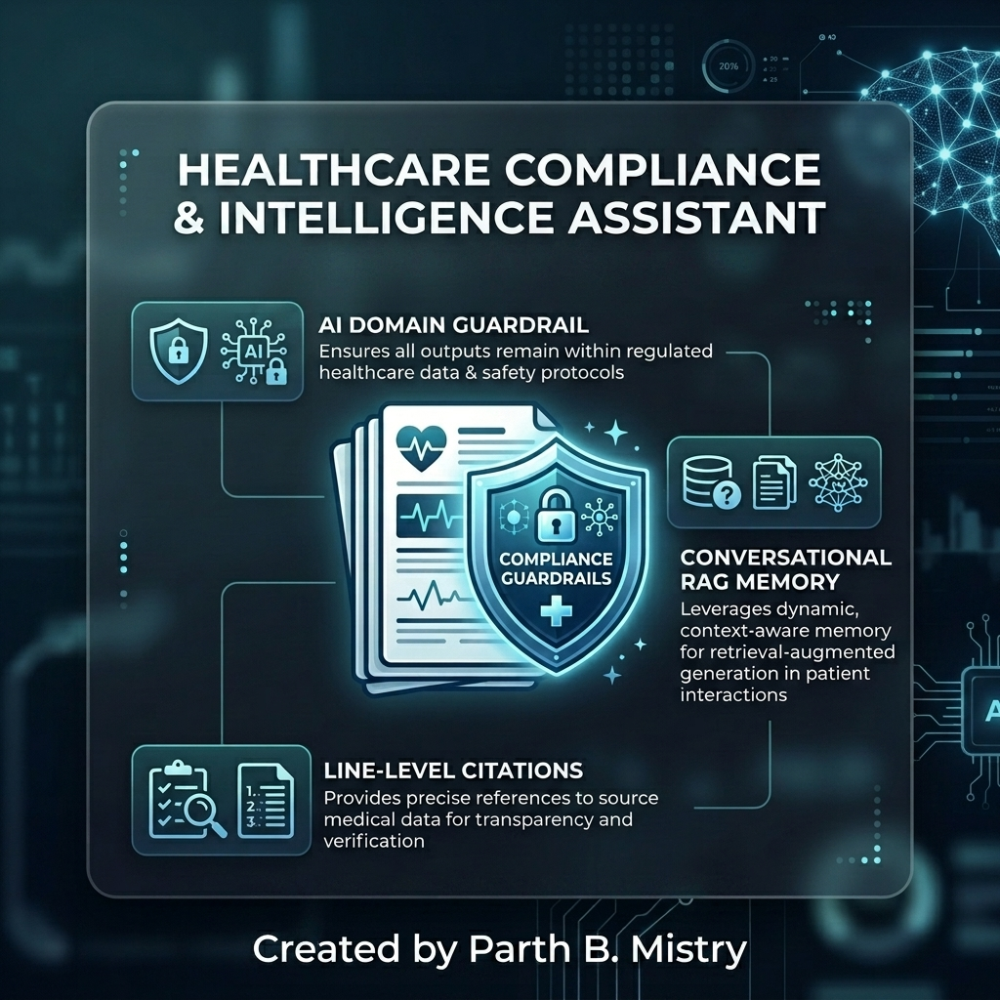
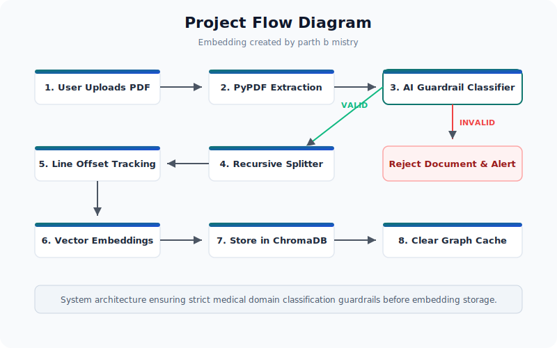
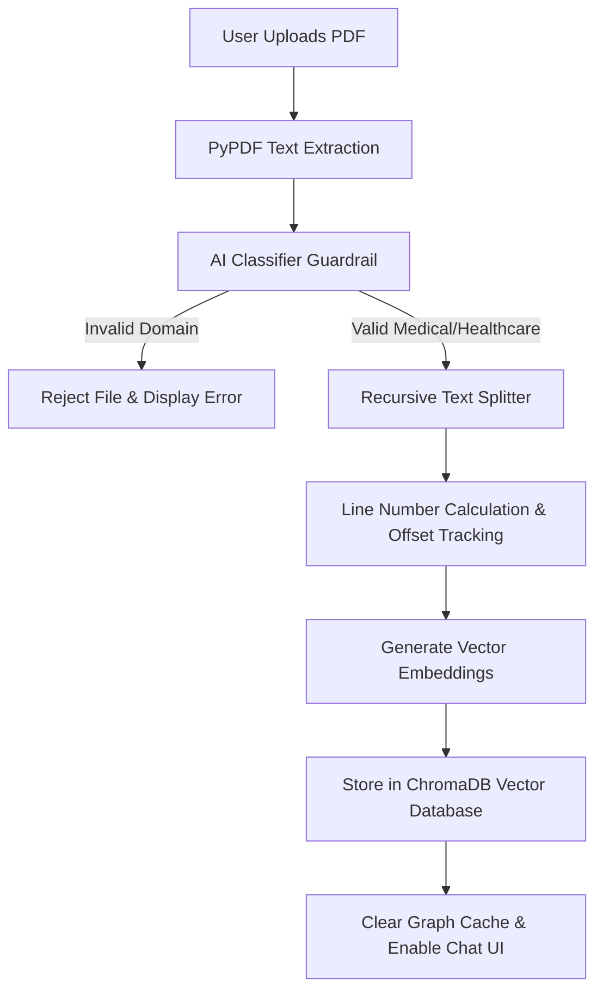
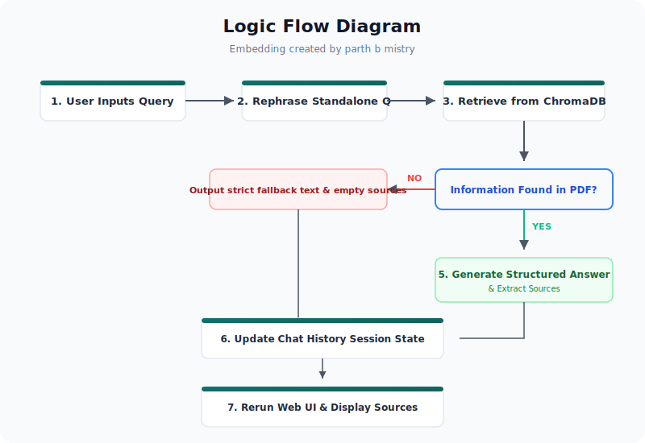
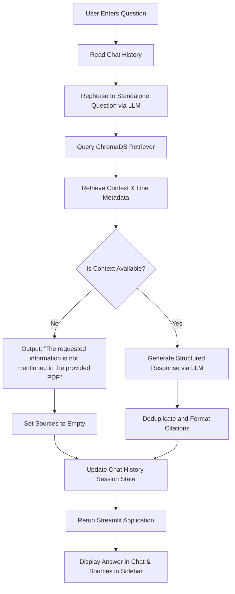

# Healthcare Compliance & Intelligence Assistant

RAG-Based, AI-Driven Compliance & Regulatory Intelligence for Healthcare Standards

## Application Screenshot


## Application Link
The Streamlit application runs locally at: http://localhost:8501

The FastAPI REST server runs locally at: http://localhost:8000

---

## Problem Statement
Healthcare and medical device organizations must comply with complex regulatory standards such as FDA 21 CFR Part 820, ISO 13485, and EU MDR. Manually reviewing thousands of pages of technical files, quality manuals, and clinical reports to verify compliance is time-consuming and prone to human oversight. Furthermore, existing document search systems lack domain-specific validation, allowing irrelevant documents (such as financial reports or recipe files) to clutter the knowledge base, leading to hallucinations and inaccurate compliance audits.

---

## Solution and Results
The Healthcare Compliance & Intelligence Assistant provides an automated, domain-guarded Retrieval-Augmented Generation (RAG) system. The solution delivers the following results:
1. Domain Validation: An automated AI guardrail reviews incoming files and rejects non-medical documents before ingestion.
2. Accurate Audits: Retrives exact compliance metrics and regulations, formatting answers in structured markdown reports.
3. Verified Citations: All retrieved statements are linked to exact line numbers and page references, which are displayed in a clean, interactive sidebar.

---

## Technology Stack and Functions
1. Streamlit: Serves as the web user interface, providing document upload status, chat messaging, and the interactive source inspector.
2. FastAPI and Uvicorn: Expose REST API endpoints, allowing third-party applications to run queries and retrieve structured citations over HTTP.
3. LangGraph: Manages the conversational agent state machine and coordinates the query rephrasing, document retrieval, and response generation workflow.
4. ChromaDB: Acts as the vector database, storing embedded document chunks and executing similarity-based semantic searches.
5. HuggingFace Sentence Transformers: Generates high-quality vector embeddings from text chunks.
6. Groq Llama-3: Serves as the underlying Large Language Model (LLM) for document classification, question rephrasing, and structured response generation.
7. PyPDF: Extracts text from uploaded PDF files.
8. Python-Dotenv: Manages configuration settings and environment variables securely.

---

## Project Structure
```text
d:\Med ai\
├── api/
│   ├── __init__.py
│   ├── main.py              # FastAPI server entry point and endpoint registration
│   └── routes.py            # API routing for the /ask conversational endpoint
├── config/
│   ├── __init__.py
│   └── settings.py          # Configuration settings, directory paths, and defaults
├── graph/
│   ├── __init__.py
│   ├── nodes.py             # Condense, retrieve, and generate step logic for LangGraph
│   ├── rag_graph.py         # Workflow state machine compilation
│   └── state.py             # TypedDict defining the graph execution state variables
├── ingestion/
│   ├── __init__.py
│   ├── classifier.py        # AI guardrail checking if a document is medical/healthcare related
│   ├── embeddings.py        # Embedding model initialization
│   ├── pdf_loader.py        # PyPDF loader extracting text from uploaded documents
│   └── text_splitter.py     # Recursive text splitter with line number offset calculations
├── llm/
│   ├── __init__.py
│   └── groq_model.py        # Model initialization and interface for Groq API
├── utils/
│   ├── __init__.py
│   └── citation_formatter.py # Logic for deduplicating, sorting, and formatting source references
├── vectorstore/
│   ├── __init__.py
│   ├── chroma_db.py         # Database initialization, document insertion, and cleanup operations
│   └── retriever.py         # Vector similarity search retrieval configurations
├── .env                     # Local configuration and API keys
├── app.py                   # Main Streamlit web application interface
└── requirements.txt         # Python dependencies
```

---

## Project Flow Diagram (Embedding created by parth b mistry)




---

## Logic Flow Diagram (Embedding created by parth b mistry)




---

## Uniqueness and Speciality
1. Automatic Domain Guardrail: Rejects unrelated documents at the ingestion stage, protecting the database from pollution.
2. Offset Line Tracking: Tracks the exact starting and ending line number of every chunk, rather than just referencing the page.
3. Sidebar Citation Inspector: Keeps the conversation window clean by moving citation details into a dedicated, selectbox-based inspector in the sidebar.
4. Absolute Fallback Integrity: If the data does not exist in the uploaded files, the assistant outputs only the exact fallback message without hallucinating.

---

## Restrictions, Challenges and Solutions
1. Challenge: Large PDF files caused search lag and context window limits.
   - Solution: Implemented recursive character splitting with a chunk size of 1000 characters and 200 characters overlap to maintain context.
2. Challenge: Conversational follow-ups like "What about warnings?" lacked context for vector database searches.
   - Solution: Added a LangGraph rephrasing node that uses chat memory to reconstruct standalone search queries.
3. Challenge: Out-of-sync source selection in the Streamlit UI lifecycle.
   - Solution: Implemented automatic session state updates combined with immediate application rerun triggers.

---

## Time Reduction (Why and How)
* Why: Manual compliance reviews require auditors to read multi-page documents, cross-reference regulations, and check specific line assertions, which takes hours.
* How: The assistant completes this in seconds by fetching only the matching document segments, generating direct answers, and pinpointing exact source pages and line numbers.

---

## Future Enhancements
1. Multi-Document Comparison: Enable side-by-side compliance audits across multiple uploaded files.
2. Optical Character Recognition: Process scanned PDF documents and image-only technical sheets.
3. Automated Checklist Auditing: Upload a compliance checklist and let the assistant check the entire knowledge base for each requirement.

---

## Industry Oriented
The system is built specifically for quality assurance managers, regulatory affairs professionals, and compliance auditors in the healthcare, medical device, and biotechnology industries. It directly assists in preparation for ISO 13485 audits, FDA inspections, and compliance checks for Technical Documentation files.
